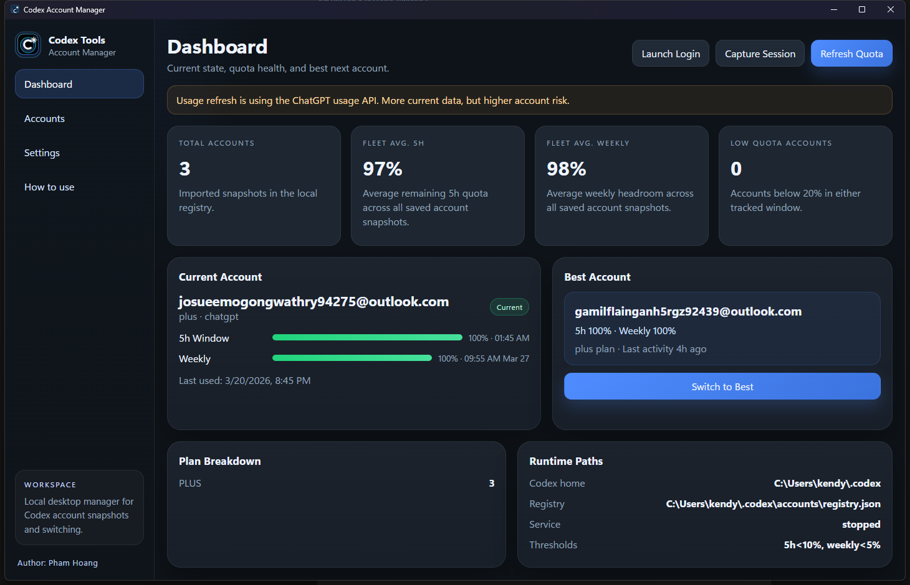

# Codex Account Manager



Codex Account Manager is a local Electron desktop app for managing Codex account snapshots on Windows. It gives you a cleaner GUI for login, session capture, quota refresh, and fast account switching while still using the `codex-auth` runtime under the hood.

## What It Does

- desktop dashboard for account health and quota overview
- quick login flow with `Launch Login` + `Capture Session`
- saved account snapshots in `~/.codex/accounts`
- one-click switching between imported accounts
- quota refresh through the `codex-auth` backend
- in-app `How to use` guide for teammates

## Current Tabs

- `Dashboard`: current account, best account suggestion, fleet averages, plan breakdown, runtime paths
- `Accounts`: search, filter, inspect quota snapshots, and switch accounts
- `Settings`: toggle usage API mode and background auto-switch behavior
- `How to use`: built-in usage guide for the app workflow

## Typical Workflow

1. Open the app.
2. Click `Launch Login`.
3. Complete the Codex sign-in flow in the terminal window.
4. Return to the app and click `Capture Session`.
5. Click `Refresh Quota` when you want the latest usage snapshot.
6. Use the `Accounts` tab to switch to another saved account.

## Download

The easiest way to use the app is from the latest GitHub Release:

- [Releases](https://github.com/soicoi/codex-account-manager/releases)

Current Windows portable build:

- `Codex-Account-Manager-0.2.2-alpha.1-win-x64-portable.zip`

Notes:

- the Windows build is currently unsigned, so SmartScreen may warn on first launch
- extract the zip first, then run `Codex Account Manager.exe`

## Run From Source

Requirements:

- Windows
- Node.js 18+
- npm

Install dependencies and start the desktop app:

```powershell
npm.cmd install
npm.cmd run manager:start
```

There is also a browser fallback used during development:

```powershell
npm.cmd run manager:web
```

Then open `http://127.0.0.1:4286`.

## Data Storage

The app uses the current Windows user's Codex data folder. It does not store account data inside the app folder.

Main files:

- `C:\Users\<your-user>\.codex\auth.json`
- `C:\Users\<your-user>\.codex\accounts\registry.json`
- `C:\Users\<your-user>\.codex\accounts\*.auth.json`

Meaning:

- `auth.json`: the account currently active for Codex
- `registry.json`: saved account registry, active account info, and settings
- `*.auth.json`: per-account snapshots used for switching

## Usage Refresh Mode

The app supports two quota refresh modes through `codex-auth`:

1. `Usage API` enabled: more current quota data, but higher account risk
2. `Usage API` disabled: local-session-based refresh only, which is safer but may lag behind

When API mode is enabled, your ChatGPT access token is used to request quota data from OpenAI endpoints. That may carry detection or policy risk. Use it only if you accept that tradeoff.

## Project Notes

- this repo started from `codex-auth` and now includes the desktop manager in [`manager/`](./manager)
- the desktop app currently targets Windows first
- the convenience source launcher is [`Launch-Codex-Account-Manager.bat`](./Launch-Codex-Account-Manager.bat)
- implementation notes live in [`docs/manager-ui.md`](./docs/manager-ui.md)

## Development

Useful commands:

```powershell
npm.cmd run manager:start
npm.cmd run manager:web
npm.cmd run manager:build
```

`manager:build` uses `electron-builder`. On some Windows setups, the signing helper download can fail because of symlink privileges. In that case, `dist/win-unpacked` is still useful as a portable output.

## Credits

- Author: Pham Hoang
- Based on the original `codex-auth` runtime by Loongphy
